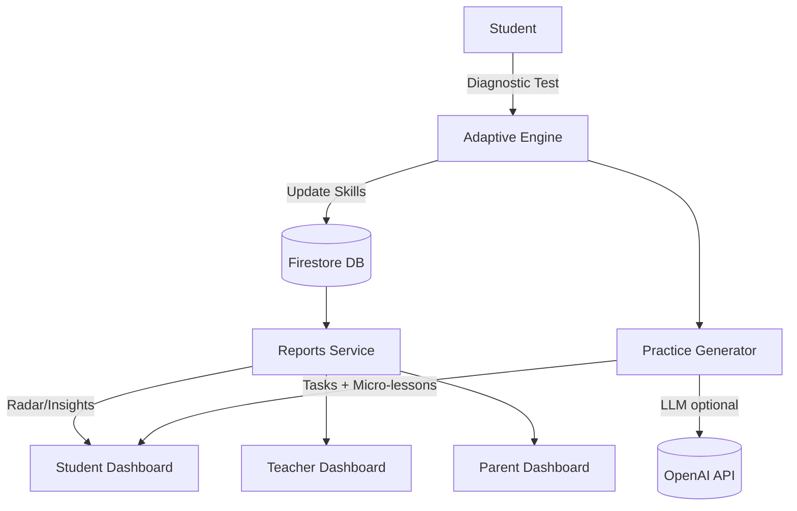

# 📚 LearnSight – Adaptive Diagnostic + Targeted Practice

LearnSight is an adaptive learning platform that diagnoses student strengths and weaknesses across four fundamentals — **Listening, Grasping, Retention, and Application** — and generates personalized practice plans with real-time progress reports for students, teachers, and parents.

---

## 🚀 Features (MVP Scope)

- 🎯 **Adaptive Diagnostic Test** – 10–15 questions that dynamically adjust difficulty.
- 🧩 **Skill Mapping** – Every response is mapped to fundamentals: listening, grasping, retention, and application.
- 📊 **Personalized Reports** – Radar charts and simple recommendations for each student.
- 📝 **Targeted Practice Queue** – Micro-lessons (2–5 problems each) generated for each weak skill.
- 👩‍🏫 **Teacher Dashboard** – Class overview with exportable reports.
- 👨‍👩‍👧 **Parent Access** – A simple view of the student’s progress and support suggestions.

---

## 🛠 Tech Stack

### Frontend

- [Next.js](https://nextjs.org) (App Router)
- [TailwindCSS](https://tailwindcss.com) for rapid UI styling
- [Recharts](https://recharts.org) for interactive graphs

### Backend & Infra

- [Firebase Auth](https://firebase.google.com/docs/auth) – Authentication
- [Firestore](https://firebase.google.com/docs/firestore) – Database
- [Firebase Cloud Functions](https://firebase.google.com/docs/functions) – Adaptive logic
- [Vercel](https://vercel.com) – Frontend hosting

### Optional AI/ML Layer

- [OpenAI API](https://platform.openai.com/) – For explanations, hints, and micro-lesson generation.

---

## 📂 Project Structure

```bash
learnsight/
├── app/ # Next.js App Router pages
│ ├── login/ # Auth pages
│ ├── parent/ # Parent dashboard
│ ├── student/ # Student dashboard, diagnostic, reports
│ ├── teacher/ # Teacher dashboard
│ └── page.tsx # Landing page
├── components/ # Shared UI components
├── public/ # Static assets
├── styles/ # Global styles (Tailwind, etc.)
├── package.json
└── README.md
```

---

## ⚡ Getting Started (Local Development)

1.  **Clone the repository**

    ```bash
    git clone https://github.com/dipexplorer/learnsight.git
    cd learnsight
    ```

2.  **Install dependencies**

    ```bash
    npm install
    ```

3.  **Set up environment variables**
    Create a `.env.local` file in the root directory and add your credentials:

    ```env
    NEXT_PUBLIC_FIREBASE_API_KEY=your_key
    NEXT_PUBLIC_FIREBASE_AUTH_DOMAIN=your_project.firebaseapp.com
    NEXT_PUBLIC_FIREBASE_PROJECT_ID=your_project_id
    OPENAI_API_KEY=your_openai_key # if using LLM
    ```

4.  **Run the development server**

    ```bash
    npm run dev
    ```

    Open [http://localhost:3000](https://www.google.com/search?q=http://localhost:3000) in your browser. 🚀

---

## 🎬 Demo Flow (Hackathon)

Student login → Adaptive Diagnostic → Radar Report → Personalized Practice Plan generated live.

**Teacher Dashboard:** Compare students (e.g., Ram, Shyam, Sanga).

**Parent Dashboard:** View simple progress and recommendations.

---

## 🏗 System Architecture



---

## 📊 Evaluation Fit

- **Innovation & Creativity (30%)** – Adaptive engine combined with AI-powered micro-lessons.
- **Technical Implementation (30%)** – Modern stack with Firebase, Next.js, and custom adaptive logic.
- **Relevance (20%)** – Directly measures and improves fundamental learning skills.
- **Clarity (20%)** – Clean dashboards and a demo-ready user flow.

---

## 👥 Team & Credits

Built with ❤️ by **[Your Team Name]** for **[Hackathon Name]**.

---

## 📜 License

This project is licensed under the MIT License. You are free to use, modify, and distribute it with attribution.
