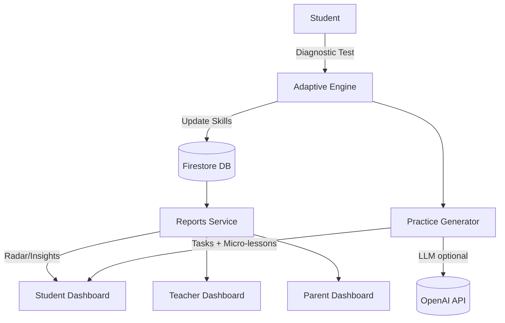

# 📚 LearnSight – Adaptive Diagnostic + Targeted Practice

LearnSight is an adaptive learning platform that diagnoses student strengths and weaknesses across four fundamentals — **Listening, Grasping, Retention, and Application** — and generates personalized practice plans with real-time progress reports for students, teachers, and parents.

---

## 🚀 Features (MVP Scope)

- 🎯 **Adaptive Diagnostic Test** – 10–15 questions that dynamically adjust difficulty.
- 🧩 **Skill Mapping** – Every response is mapped to fundamentals: listening, grasping, retention, and application.
- 📊 **Personalized Reports** – Radar charts and simple recommendations for each student.
- 📝 **Targeted Practice Queue** – Micro-lessons (2–5 problems each) generated for each weak skill.
- 👩‍🏫 **Teacher Dashboard** – Class overview with exportable reports.
- 👨‍👩‍👧 **Parent Access** – A simple view of the student’s progress and support suggestions.

---

## 🛠 Tech Stack

### Frontend

- [Next.js](https://nextjs.org) (App Router)
- [TailwindCSS](https://tailwindcss.com) for rapid UI styling
- [Recharts](https://recharts.org) for interactive graphs

### Backend & Infra

- [Firebase Auth](https://firebase.google.com/docs/auth) – Authentication
- [Firestore](https://firebase.google.com/docs/firestore) – Database & Adaptive logic
- [Render](https://render.com) – Hosting

### Optional AI/ML Layer

- [OpenAI API](https://platform.openai.com/) – For explanations, hints, and micro-lesson generation.

---

## 📂 Project Structure

```bash
learnsight/
app/
    ├── api/
        ├── auth/
            ├── signup/
                └── route.ts
            └── verify/
                └── route.ts
        ├── diagnostic/
            ├── attempt/
                └── latest/
                    └── route.ts
            ├── complete/
                └── route.ts
            ├── get-attempt/
                └── route.ts
            ├── next-question/
                └── route.ts
            ├── start-attempt/
                └── route.ts
            └── submit-answer/
                └── route.ts
        ├── paper/
            └── [id]/
                └── route.ts
        ├── practice/
            ├── generate/
                └── route.ts
            ├── session/
                └── [id]/
                    └── route.ts
            └── sessions/
                └── route.ts
        ├── questions/
            └── [id]/
                └── route.ts
        ├── student/
            └── [id]/
                ├── dashboard/
                    └── route.ts
                ├── radar/
                    └── route.ts
                ├── reports/
                    └── route.ts
                └── update/
                    └── route.ts
        └── teacher/
            └── [id]/
                ├── alerts/
                    └── route.ts
                ├── dashboard/
                    └── route.ts
                ├── reports/
                    └── route.ts
                └── students/
                    └── route.ts
    ├── dev-auth/
        └── page.tsx
    ├── login/
        ├── loading.tsx
        └── page.tsx
    ├── parent/
        ├── dashboard/
            └── page.tsx
        ├── progress/
            └── page.tsx
        └── support/
            └── page.tsx
    ├── student/
        ├── dashboard/
            └── page.tsx
        ├── diagnostic/
            └── page.tsx
        ├── practice/
            ├── [id]/
                └── page.tsx
            └── page.tsx
        ├── profile/
            └── page.tsx
        └── reports/
            └── page.tsx
    ├── teacher/
        ├── dashboard/
            └── page.tsx
        ├── reports/
            └── page.tsx
        └── students/
            ├── loading.tsx
            └── page.tsx
    ├── globals.css
    ├── layout.tsx
    └── page.tsx
components/
    ├── layout/
        ├── footer.tsx
        └── navbar.tsx
    ├── ui/
        ├── badge.tsx
        ├── button.tsx
        ├── card.tsx
        ├── input.tsx
        ├── label.tsx
        ├── loader.tsx
        ├── progress.tsx
        ├── radio-group.tsx
        ├── select.tsx
        ├── sheet.tsx
        ├── table.tsx
        ├── tabs.tsx
        └── textarea.tsx
    ├── auth-guard.tsx
    ├── dashboard-layout.tsx
    ├── practice-card.tsx
    └── radar-chart.tsx
contexts/
    └── user-context.tsx
lib/
    ├── auth-context.tsx
    ├── auth.ts
    ├── auth.ts.new
    ├── db-admin.ts
    ├── firebase-admin.ts
    ├── firebase.ts
    ├── teacher-service-client-part2.ts
    ├── teacher-service-client.ts
    ├── teacher-service.ts
    └── utils.ts
scripts/
    ├── create-demo-users.js
    └── seed-demo.ts
types/
    ├── index.ts
    └── teacher.ts
utils/
    ├── adaptive.ts
    ├── practice.ts
    └── scoring.ts
.eslintrc.json
.gitignore
components.json
eslint.config.mjs
firestore.indexes.json
firestore.rules
next.config.ts
package-lock.json
package.json
postcss.config.mjs
README.md
tsconfig.json
```

---

## ⚡ Getting Started (Local Development)

1.  **Clone the repository**

    ```bash
    git clone https://github.com/dipexplorer/learnsight.git
    cd learnsight
    ```

2.  **Install dependencies**

    ```bash
    npm install
    ```

3.  **Set up environment variables**
    Create a `.env.local` file in the root directory and add your credentials:

    ```env
    NEXT_PUBLIC_FIREBASE_API_KEY=your_key
    NEXT_PUBLIC_FIREBASE_AUTH_DOMAIN=your_project.firebaseapp.com
    NEXT_PUBLIC_FIREBASE_PROJECT_ID=your_project_id
    NEXT_PUBLIC_FIREBASE_STORAGE_BUCKET=
    NEXT_PUBLIC_FIREBASE_MESSAGING_SENDER_ID=
    NEXT_PUBLIC_FIREBASE_APP_ID=
    NEXT_PUBLIC_FIREBASE_MEASUREMENT_ID=

    FIREBASE_PROJECT_ID=
    FIREBASE_CLIENT_EMAIL=
    FIREBASE_PRIVATE_KEY=
    ```

4.  **Run the development server**

    ```bash
    npm run dev
    ```

    Open [http://localhost:3000](https://www.google.com/search?q=http://localhost:3000) in your browser. 🚀

---

## 🎬 Demo Flow (Hackathon)

Student login → Adaptive Diagnostic → Radar Report → Personalized Practice Plan generated live.

**Teacher Dashboard:** Compare students (e.g., Ram, Shyam, Sanga).

**Parent Dashboard:** View simple progress and recommendations.

---

## 🏗 System Architecture



---

## 📊 Evaluation Fit

- **Innovation & Creativity (30%)** – Adaptive engine combined with AI-powered micro-lessons.
- **Technical Implementation (30%)** – Modern stack with Firebase, Next.js, and custom adaptive logic.
- **Relevance (20%)** – Directly measures and improves fundamental learning skills.
- **Clarity (20%)** – Clean dashboards and a demo-ready user flow.

---

## 👥 Team & Credits

Built with ❤️ by **[Your Team Name]** for **[Hackathon Name]**.

---

## 📜 License

This project is licensed under the MIT License. You are free to use, modify, and distribute it with attribution.
